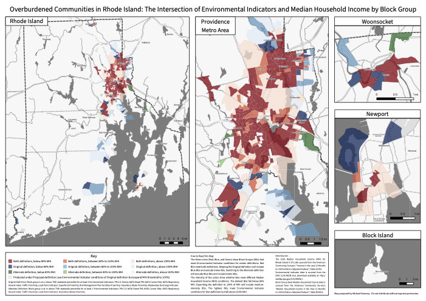

# Green Justice Zones

This project analyzed environmental indicator data to support the development of a green justice zone policy proposed by Renew Rhode Island.

## Proposed Definition

The proposed definition of an "Overburdened Community" is any Census Tract in Rhode Island that:
1. Is at or above the seventy fifth (75th) statewide percentile for at least three (3) of the following Environmental Indicators on the most recent available United States Environmental Protection Agency’s EJSCREEN Assessment: (a) PM 2.5; (b) Ozone; (c) NATA Diesel PM; (d) NATA Cancer Risk; (e) NATA Respiratory Hazard Index; (f) Traffic Proximity; (g) Lead Paint Indicator; (h) Superfund Proximity; (i) Risk Management Plan Facilities Proximity; (j) Hazardous Waste Proximity; and (k) Wastewater Discharge Indicator; and
2. Has a median household income, as calculated by the US Census Bureau, that is no greater than eighty (80) percent of the statewide median household income, as calculated by the US Census Bureau.

## Mapping

Preliminary analysis of the environmental indicator data showed that limiting the indicator triggers and raising the qualifying median income threshold would more thoroughly cover overburdened communities. Further analysis was undertaken with EPA data to determine the effects of altering the proposed definition.

_Click map for larger view._

## Recommendations

The following recommendations were made:

1. Remove Ozone, Superfund Proximity, RMP Proximity, and Wastewater Discharge Indicator as triggering indicators. These indicators do not align in either definition or geographically with communities that should be considered overburdened. This will additionally prevent industrial Quonset Point from becoming an Overburdened Community.
2. Reduce number of indicators needed to trigger Overburdened Community from 3 to 2. This is due to the reduction in the number of triggering indicators from eleven to seven.
3. Raise income percentage that allows for the possibility of an Overburdened Community to 100% of Median Household Income to include more census tracts that should be but are not currently considered overburdened and to avoid non-Overburdened “island” Communities that could be used to effectively site polluting infrastructure in Overburdened Communities.